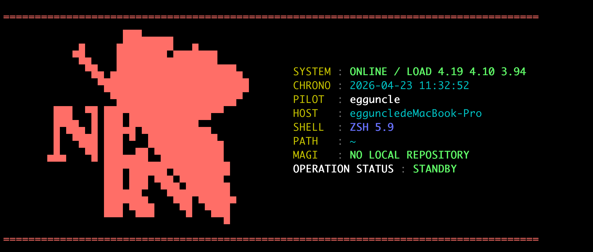

# zsh_nerv_welcome

一个 NERV 风格的 zsh 启动欢迎信息脚本。

## 预览



```zsh
zsh /Users/egguncle/mydir/develop/AI/workspace/zsh_nerv_welcome/preview.zsh
```

## 安装

把下面这一行加入 `~/.zshrc`：

```zsh
source "/Users/egguncle/mydir/develop/AI/workspace/zsh_nerv_welcome/nerv_welcome.zsh"
```

重新打开 zsh，或运行：

```zsh
source ~/.zshrc
```

## 开关

临时禁用：

```zsh
export ZSH_NERV_WELCOME_SHOWN=1
```

如果你想恢复显示，运行：

```zsh
unset ZSH_NERV_WELCOME_SHOWN
```
